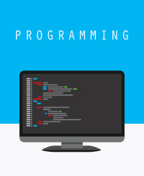

# Introducción a la programación

@[Promo](https://www.youtube.com/watch?v=XIdDLnkQfXQ)

# Módulo 0. Presentacion
[Presentación](https://player.vimeo.com/video/281774097)

# Modulo 1. Fundamentos de la programación

1. [Tipos de datos](https://player.vimeo.com/video/281775187)
2. [Operaciones](https://player.vimeo.com/video/281775160)
3. [Variables](https://player.vimeo.com/video/281775216)
4. [Comparaciones entre variables](https://player.vimeo.com/video/281775127)

[Documentación](./1_Fundamentos.pdf)

##Ejercicio práctico

1. Utiliza la consola de JavaScript para calcular:
	* Los años bisiestos que habrá antes de 2050
    * Cuántas cartas con número par y negras hay en una baraja de poker

2. Define una variable cuyo valor sea una cadena que represente una carta de la baraja. Recuerda que representamos las cartas con una cadena formada por un número que representa el valor, seguido de una letra que representa el palo. Ahora crea otras dos variables que representan a la carta anterior y a las carta posterior en una baraja ordenada. Finalmente, crea una última variable que concatene las cadenas de las 3 cartas anteriores usando las variables que ya tienes.

3. Define una variable cuyo valor sea una cadena que represente una carta de la baraja, cuyo valor sea mayor que 9. Ahora utiliza el operador para indexar la cadena, y accede al palo de la carta. ¿Cuál es la diferencia si la carta tiene un valor menor o igual que 9?

# Módulo 2. Estructuras de control.

1. [Estructuras de selección](https://player.vimeo.com/video/281776433)
2. [Estructuras de iteración](https://player.vimeo.com/video/281776408) 

[Documentación](./2_Estructuras_Control.pdf)

## Ejercicio práctico

1. Programa un ejemplo que, dada una variable de tipo cadena con la carta del 4 de corazones, compruebe si es de corazones y además es el número 4. En caso afirmativo, lo imprimimos en la consola. Probamos el mismo programa con el 3 de corazones, y con el rey de corazones. ¿Qué sucede?

2. Utiliza un bucle para recorrer todos los años bisiestos anteriores a 2050, e imprímelos en la consola.

3. Utiliza un bucle para recorrer todas las cartas de la baraja, desde el 1 al 12 de cada palo. Imprime en pantalla solamente las cartas rojas que sea múltiplos de 3.

# Módulo 3. Estructura de datos

1. [Arrays](https://player.vimeo.com/video/281778046)
2. [Aritmética de Arrays](https://player.vimeo.com/video/281778006)
3. [Diccionarios](https://player.vimeo.com/video/281778115)
4. [Combinaciones de estructuras de datos](https://player.vimeo.com/video/281778084) 

[Documentación](./3_Estructura_Datos.pdf)

## Ejercicio práctico
1. Programa un ejemplo que almacene en un array todas las cartas de la baraja, cada una representada con un diccionario que tenga un palo y un valor.

2. Partiendo del array que has construido en el ejercicio anterior, construye un algoritmo que filtre en un nuevo array sólo las cartas rojas, y en otro array las cartas negras.

3. Partiendo del array que has construido en el ejercicio anterior, construye un algoritmo que filtre en un nuevo array las cartas rojas y pares. Luego imprime en la consola la última carta de ese nuevo array.

# Módulo 4. Funciones y programas

1. [Declaración de funciones](https://player.vimeo.com/video/281779593)
2. [Llamadas a funciones y estructura de un programa](https://player.vimeo.com/video/281779629)

[Documentación](./4_Funciones_Programas.pdf)

## Ejercicio práctico
1. Desarrolla una función que puntúe una mano de cartas, que tenga como parámetro un array de cartas, cada una representada por un diccionario con palo y valor. Al puntuar, las cartas suman su valor excepto si es un as que suma 20. Prueba a invocarla con varias manos de cartas con y sin ases.

2. Partiendo de la función anterior, modíficala para que además las cartas rojas sumen el doble. Prueba a invocarla con varias manos de cartas.

3. Desarrolla un programa que use la función anterior para puntuar las manos de cartas de dos jugadores e imprima por consola al ganador, es decir, al que obtenga mayor puntuación.

# Módulo 5. Librerías de código

1. [Creando nuestra librería de código](https://player.vimeo.com/video/281779660)
2. [Ejemplos con librerías](https://player.vimeo.com/video/281779682) 

[Documentación](./5_Librerias_Codigo.pdf)

## Ejercicio práctico

1. Desarrolla una librería Croupier que tenga una función para barajar cartas. Para barajar, intercambiamos una carta aleatoria dentro de nuestra baraja por otra. Y esto lo hacemos 100 veces. Se recomienda usar la librería Math.random. Por ejemplo, intercambiar la carta en la posición 7 por la carta en la posición 24.

2. Desarrolla nuevas funciones de la librería Croupier: Repartir, que toma la carta en primera posición de la baraja y la elimina del array Puntuar que, dada una mano de 4 cartas sume su valor. Pero si todas las cartas son iguales, multiplica el valor por 10.

3. Desarrolla una librería Calculadora que calcula las longitudes de varias figuras geométricas como cuadrados, rectángulos y círculos.

# Módulo 6. Objetos y proyecto

1. [Objetos](https://player.vimeo.com/video/281781458) 
2. [¿Y ahora qué?](https://player.vimeo.com/video/281781520)

[Documentación](./6_Objeto_proyecto.pdf)

## Ejercicio práctico
1. Desarrolla un objeto Croupier que tenga como datos una baraja de cartas completa. Y puntuaciones especiales para el as y las figuras (jota, dama y rey).

    Jota = 12
    Dama = 14
    Rey = 17
    As = 20

2. Añade al objeto una función para tomar 5 cartas aleatorias de la baraja. Y luego para puntuar esa mano de cartas con las puntuaciones especiales.

